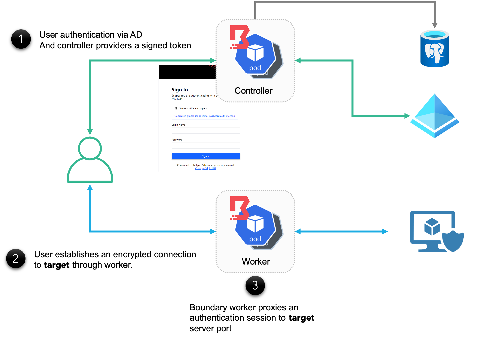
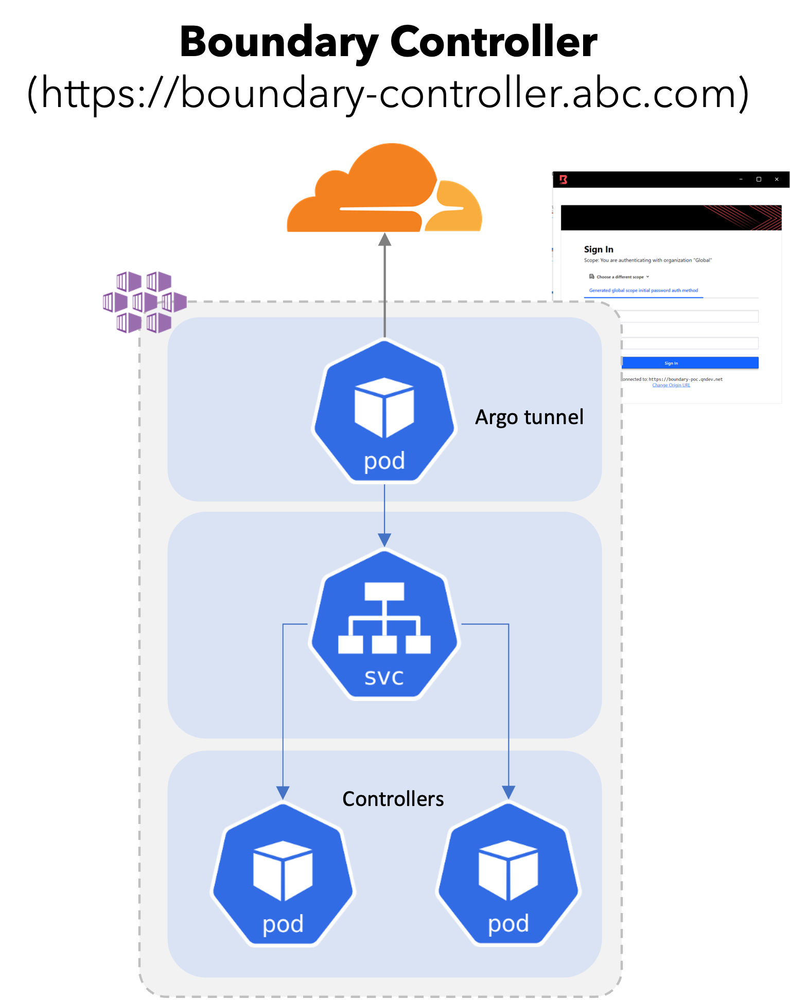
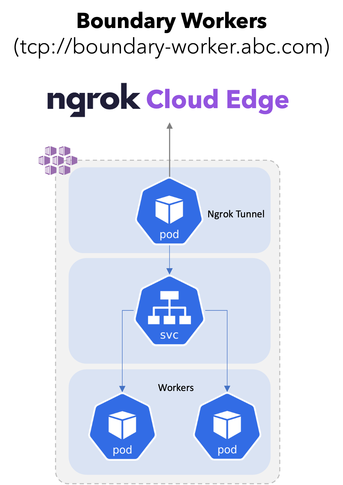

# Overview

As most of my client work remains under NDA, I've put together a simple demonstration of a generalized infrastructure-as-code implementation of a Hashicorp Boundary implementation that was deployed on the Azure cloud using Azure Kubernetes Service:

# High Level Architecture Diagram

Boundary is an open-source solution from Hashicorp, that automates secure identity-based access to hosts and services. 

This solution allows corporate users from outside the corporate environment to ***securely access*** internal services ***without*** requring a VPN

- A user authenticates with the Boundary Controller using a browser or the Boundary Desktop Application.

- Once authenticated, the user obtains an auth token that is then cryptographically verified by the Boundary Worker. The **Boundary Worker** then ***authorizes*** the user request to proxy access to the Target Server on a predefined port.

- The Boundary Client (at the user’s device) creates an encrypted tunnel via the Boundary Worker, to the ***Target Server***

# Deployment Architecture for Boundary Controller 

The deployment architecture is designed to ***avoid opening any firewall ports*** within the Azure infrastructure for allowing ingress traffic.

- The solution is designed to minimize cost by leveraging a Kubernetes deployment model vs. a VM based deployment model.

- Boundary controllers will be deployed as pods in a Kubernetes deployment and load balanced behind a Kubernetes Service.

- An Argo pod will setup the reverse tunnel to the CloudFlare edge . All internet traffic will be routed via the CloudFlare egde, through the reverse tunnel to the Boundary controller.

# Deployment Architecture for Boundary Worker

The deployment architecture is designed to ***avoid opening any firewall ports*** within the Azure infrastructure for allowing ingress traffic.

- The solution is designed to minimize cost by leveraging a Kubernetes deployment model vs. a VM based deployment model.

- Boundary workers will be deployed as pods in a Kubernetes deployment and load balanced behind a Kubernetes Service.

- Boundary workers need to expose TCP endpoint vs. an HTTP endpoint to the boundary client. CloudFlare free subscription does not allow TCP endpoints at the edge. 

- As such, it is recommended to either upgrade to CloudFlare enterprise or leverage the Cloud Edge service from ngrok as illustrated on the adjacent diagram.
